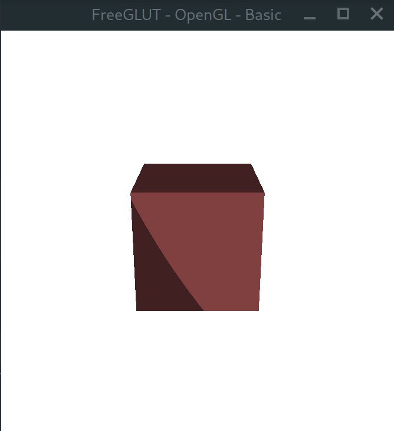
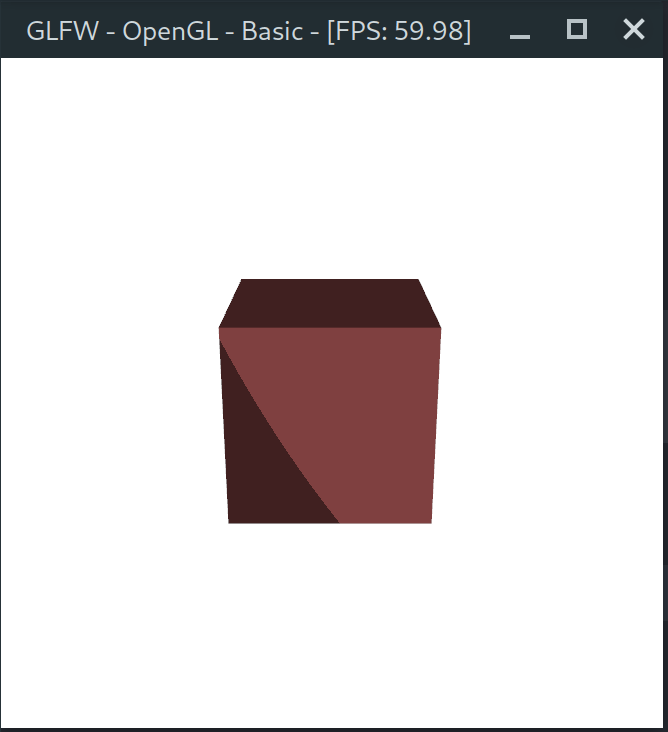
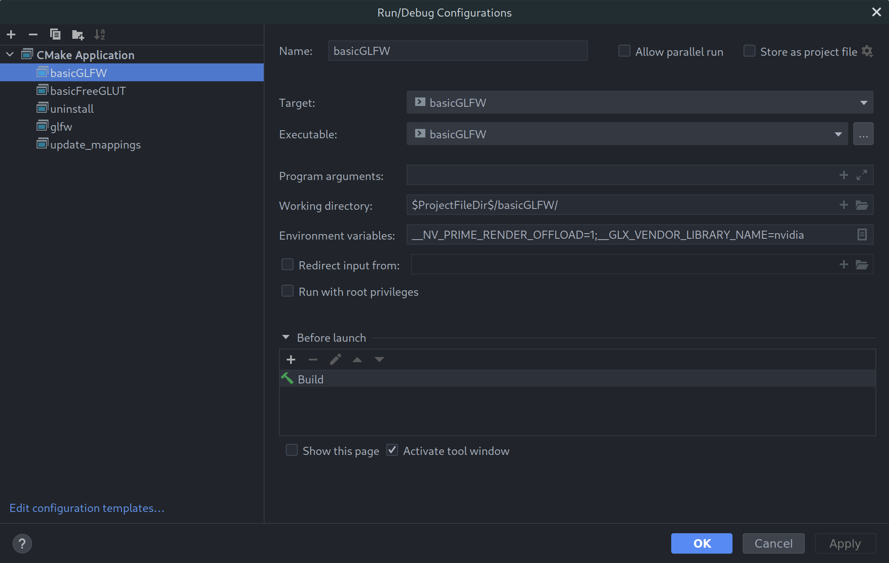

#  OpenGL-Starting-Place
> OpenGL Starting Place, 
> A Template to get started making opengl projects and assignments,
> Mostly using c code in cpp files

| freeglut                                           | glfw                                       |
|----------------------------------------------------|--------------------------------------------|
|  |  |


I Used [EWU](https://www.ewu.edu/)  Windows computers and My [Manjaro](https://manjaro.org/) Linux Computer for testing.

Note the systems have [FreeGLUT](http://freeglut.sourceforge.net/), [GLM](https://github.com/g-truc/glm), [GLEW](http://glew.sourceforge.net/) and, often have [DevIL](http://openil.sourceforge.net/) installed

On EWU Windows computers uses [ Visual Studio](https://visualstudio.microsoft.com/) 2019

On My Manjaro Linux computer I use [ CLion](https://www.jetbrains.com/clion/)

## Files

### C and C++


#### [Main.cpp](basicGLFW/main.cpp)

> also in basicFreeGLUT [main.cpp](basicFreeGLUT/main.cpp)

The start of the program and most of the code will be done here.

#### [Cube.cpp](basicGLFW/Cube.cpp) and [Cube.h](basicGLFW/Cube.h)

> also in basicFreeGLUT [Cube.cpp](basicFreeGLUT/Cube.cpp) and [Cube.h](basicFreeGLUT/Cube.h)

Has methods to set up cube and draw cube

### OpenGL Shaders


#### Vertex Shader ([shader.vs](basicGLFW/shader.vs))

> also in basicFreeGLUT [shader.vs](basicFreeGLUT/shader.vs)

Vertex shader (using [GLSL Support Plugin on CLion](https://plugins.jetbrains.com/plugin/6993-glsl-support))

#### Fragment Shader ([shader.fs](basicGLFW/shader.fs))

> also in basicFreeGLUT [shader.vs](basicFreeGLUT/shader.fs)

Fragment shader (using [GLSL Support Plugin on CLion](https://plugins.jetbrains.com/plugin/6993-glsl-support))

### CMake


#### Main Cmake file [CMakeLists.txt](CMakeLists.txt)

Set up the project, get libraries ready and finally call each excitable CMake File

#### basicGLFW [CMakeLists.txt](basicGLFW/CMakeLists.txt)

Set up the excitable and link it to the libraries.

#### basicFreeGLUT [CMakeLists.txt](basicFreeGLUT/CMakeLists.txt)

Set up the excitable and link it to the libraries.

##  Nvidia GPU on Linux

To use Nvidia GPU insed of integrated GPU on Linux add 
```shell
__NV_PRIME_RENDER_OFFLOAD=1;
__GLX_VENDOR_LIBRARY_NAME=nvidia;
```
To environment variables



## Documentation

| <br/>OpenGL/GLSL                                                       | GLFW                                      | freeGLUT                                                                 | <br/>cmake      |
|----------------------------------------------------------------------------------------------------------------------|-------------------------------------------|--------------------------------------------------------------------------|------------------------------------------------|
| [OpenGL (unofficial)](https://docs.gl/)                                                                              | [GLFW](https://www.glfw.org/docs/latest/) | [freeGLUT](http://freeglut.sourceforge.net/docs/api.php)                 | [ cmake](https://cmake.org/cmake/help/latest/) |
| [OpenGL (4.5 Reference Pages)](https://www.khronos.org/registry/OpenGL-Refpages/gl4/)                                |                                           | [GLUT](https://www.opengl.org/resources/libraries/glut/spec3/spec3.html) |                                                |
| [OpenGL (opengl45-quick-reference-card)(Not quick)](https://www.khronos.org/files/opengl45-quick-reference-card.pdf) |                                           |                                                                          |                                                |


#### Note using icon from icons8

| Cube                                                                       | CMake                                                                                                                             | nvidia                                                                           | linux                                                                  | windows                                                                             | jetbrains                                                                                 | visual-studio                                                                                         | c-programming                                                                                  | cpp                                                                  |
|----------------------------------------------------------------------------|-----------------------------------------------------------------------------------------------------------------------------------|----------------------------------------------------------------------------------|------------------------------------------------------------------------|-------------------------------------------------------------------------------------|-------------------------------------------------------------------------------------------|-------------------------------------------------------------------------------------------------------|------------------------------------------------------------------------------------------------|----------------------------------------------------------------------|
| [](https://icons8.com/icon/XpIRMmWi64sU/cube) | [](https://icons8.com/icon/0txwEZ5rJ07z/cmake-a-cross-platform-free-and-open-source-software-tool) | [](https://icons8.com/icon/yqf95864UzeQ/nvidia) | [](https://icons8.com/icon/17842/linux) | [](https://icons8.com/icon/108792/windows-10) | [](https://icons8.com/icon/pj15SuHu3Vlt/jetbrains) | [](https://icons8.com/icon/ezj3zaVtImPg/visual-studio) | [](https://icons8.com/icon/40670/c-programming) | [](https://icons8.com/icon/40669/c%2B%2B) |


https://icons8.com/license
